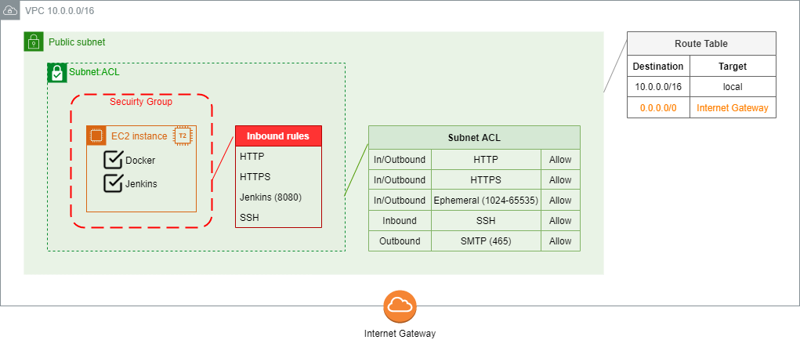

# Project001

## Demo description

A Jenkins pipeline triggered by GitHub's webhook (at pushes) builds a Docker image to host a website (simply an index.html) using Apache. The image is also uploaded to DockerHub.

PS.: If using AWS EC2 instance to run the demo, CloudFormation file included deploys the machine with everything necessary (except manual steps to configure Jenkins)

## Repo files overview

* File [jenkinsfile](jenkinsfile) (groovy):
  * clones this GitHub folder (Prooject001);
  * builds corresponding dockerfile;
  * tests built image;
  * uploads image into DockerHub with tags 'latest' and Jenkins' build_number;
  * cleans local images
  * IMPORTANT
	* check Jenkins preparation section for requirements and pipeline configuration.
  

corresponding diagram

* File [dockerfile](dockerfile):
  * built from image httpd;
  * copies website folder to Apache's standard folder;
  * uses port 80.
* File [cloudformation.yml](cloudformation.yml):
  * creates very (very!) simple VPC
    * 1 subnet (public);
    * 1 route table (for public subnet);
    * 1 internet gateway (route in public route table);
    * 1 network NACL (for public traffic)
      * HTTP/HTTPS/Ephemeral for In/Outbound
	  * SSH for Inbound (if necessary)
	  * SMTP for Outbound
  * creates security group for instance
    * HTTP/HTTPS/SSH/8080 for Inbound (8080 = Jenkins)
	* SSH for Inbound (if necessary)
  * creates an EC2 instance
    * t2.micro;
    * ubuntu 20.04;
    * cloud init installs Jenkins and Docker
  

corresponding diagram

* File [jenkins-pipeline-config.xml](jenkins-pipeline-config.xml):
  * export of pipeline's configuration.

## Preparing environment

### Create AWS CloudFormation stack

1. Create stack using cloudformation.yml
   * EC2 instance will already have Docker and Jenkins installed
1. Open jenkins (http:\\EC2_IP:8080)
   * EC2_IP is outupt by cloudformation under "public ip for ec2"
   * Jenkins URL is also output by cloudformation

### Finish Jenkins installation

1. Connect to server by SSH to acquire unlock password
   * sudo cat /var/lib/jenkins/secrets/initialAdminPassword (or folder indicated on Jenkins' welcome screen)
1. Install plugins (Github, Docker Pipeline, Email Extension)
   * some of they may not be available from installing screen; necessary to install later, after Jenkins initialization
1. Create user/password
1. Save and finish

### Prepare credentials for Jenkins operation

1. TODO: copy/reformat text from .txt here

### Configure Jenkins pipeline

1. TODO: copy/reformat text from .txt here
