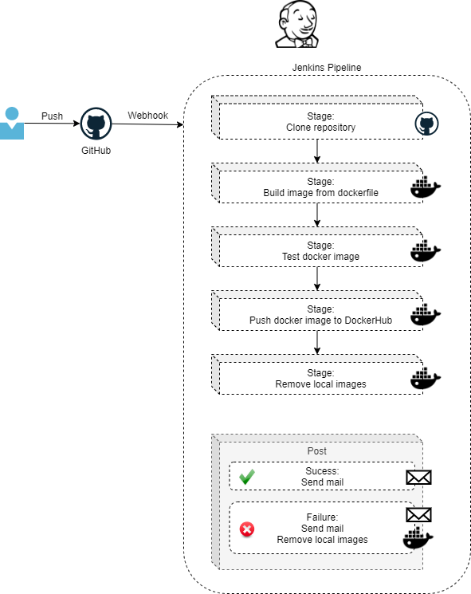

# Project001

## Demo description

A Jenkins pipeline triggered by GitHub's webhook (at pushes) builds a Docker image to host a website (simply an index.html) using Apache. The image is also uploaded to DockerHub.

If using AWS EC2 instance to run the demo, there is a CloudFormation file included to deploy everything necessary.

All diagrams included in documentation are Draw.io's editable PNGs.

## Repo files overview

* File [jenkinsfile](jenkinsfile) for pipeline (groovy):
  * clones this GitHub folder (Prooject001);
  * builds corresponding dockerfile;
  * tests built image;
  * uploads image into DockerHub with tags 'latest' and Jenkins' build_number;
  * cleans local images
   

corresponding diagram

* File [dockerfile](dockerfile):
  * built from image httpd;
  * copies website folder to Apache's standard folder;
  * uses port 80
* File [cloudformation.yml](cloudformation.yml):
  * creates very (very!) simple VPC
    * 1 subnet (public);
    * 1 route table (for public subnet);
    * 1 internet gateway (route in public route table);
    * 1 network NACL (for public traffic) 
      * HTTP/HTTPS/SSH/Ephemeral for In/Outbound
      * SMTP for Outbound
      * \*\*\* If not using AWS stack for demo, remember to apply the above firewall rules
  * creates security group for instance
    * HTTP/HTTPS/SSH/8080 for Inbound (8080 = Jenkins)
    * SSH for Inbound (if necessary)
  * creates an EC2 instance
    * t2.micro;
    * ubuntu 20.04;
    * Jenkins and Docker installed by cloud init
   

corresponding diagram

* File [jenkins-pipeline-config.xml](jenkins-pipeline-config.xml):
  * export of pipeline's configuration.

## Preparing environment

### Create AWS CloudFormation stack

1. Create stack using cloudformation.yml\*
   * EC2 instance will already have Docker and Jenkins installed
1. Open jenkins (http:\\SERVER_IP:8080)
   * SERVER_IP is outupt by cloudformation under "public ip for ec2"
   * Jenkins URL is also output by cloudformation

\* If not using AWS stack for demo, do not forget firewall rules as described in [CloudFormation description](#firewallrules)

### Finish Jenkins installation

1. Connect to server by SSH to acquire unlock password
   * sudo cat /var/lib/jenkins/secrets/initialAdminPassword (or folder indicated on Jenkins' welcome screen)
1. Install plugins
   * names
     * Github Plugin
     * Docker Pipeline
     * Email Extension Plugin
   * some of they may not be available from installing screen; necessary to install later, after Jenkins initialization
1. Create user/password
1. Save and finish

### Configure Jenkins for integration to GitHub

Details at [GitHub integration](https://github.com/MariMendM/devops-sandbox/wiki/Jenkins#JenkinsGitHub). The subsection describing webhook configuration requires Jenkins' pipeline already created.

### Configure Jenkins for integration to Docker/DockerHub

Details at [Configuring Docker/DockerHub integration](https://github.com/MariMendM/devops-sandbox/wiki/Jenkins#JenkinsDocker)

### Configure Email Notifications

Details at [Configuring Extended email notification](https://github.com/MariMendM/devops-sandbox/wiki/Jenkins#JenkinsExtEmailNot)

### Configure Jenkins pipeline

Pipeline can be created based in [jenkins-pipeline-config.xml](jenkins-pipeline-config.xml). Main points to remeber:
* Parameterize pipeline with variables, as required by jenkinsfile
* Define configuration "Pipeline script from SCM", indicating "Project001/jenkinsfile" as script path
* For GitHub's webhook to work, the pipeline must be manually run at least once
