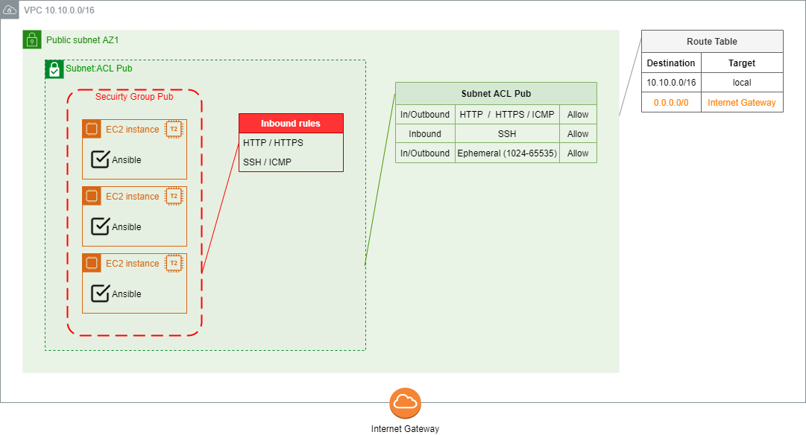

# Project002

## Content

* [Demo description](#demo-description)
* [Repo files overview](#repo-files-overview)
* [Preparing Environment](#preparing-environment)
  * [### Configure host to run entry point playbook](#configure-host-to-run-entry-point-playbook)
  * [Create a key-pair](#create-a-key-pair)
  * [Running the provision playbook](#running-the-provision-playbook)
* [How to use](#how-to-use)
* [Next steps](#next-steps)

## Demo description

Demonstrate Ansible's automated install and configuration over AWS Cloud. From a host with Ansible installed, a playbbok provisions AWS CloudFormation stack, creates both in-memory and file inventories, and then waits stack EC2 instances be ready to use. After that, the EC2instances created can be used as managed hosts for any other Ansible playbook desired (a testing playbook is provided).

```diff
# Reminder: all diagrams included in documentation are Draw.io's editable layered PNGs.
```

## Repo files overview

* File [cloudformation.yml](cloudformation.yml):
  * Used by 'playbook-provision-environment.yml' to provision AWS stack containing:
    * a VPC
      * 1 subnet (public);
      * 1 route table (for public subnet);
      * 1 internet gateway (route in public route table);
      * 1 network NACL (for public traffic)
        * HTTP/HTTPS/Ephemeral allowed for In/Outbound to CIDR 0.0.0.0/0
        * SSH allowed for In/Outbound to CIDR provided for maintenance
    * security group for instances
      * HTTP/HTTPS allowed for Inbound to CIDR 0.0.0.0/0
      * SSH allowed for Inbound to CIDR provided for maintenance
    * EC2 instances
      * t2.micro;
      * ubuntu 20.04;
      * Ansible installed by cloud init
  * <details><summary>see corresponding diagram</summary></details>
* File [requirements.yml](requirements.yml):
  * TODO :pushpin:
* File [playbook-provision-environment.yml](playbook-provision-environment.yml):
  * TODO :pushpin:
* File [playbook-provision-environment.json](playbook-provision-environment.json):
  * TODO :pushpin:
* File [playbook-testing.yml](playbook-testing.yml):
  * TODO :pushpin:

## Preparing environment

### Configure host to run entry point playbook

The entry point of this demo is the 'playbook-provision-environment.yml' file. To run it, it is necessary to install:

1. Python and pip (some linux systems already have them installed by default):
```
sudo apt install python3 python3-pip -y
```
1. Python's boto3:
```
pip install boto3
```
1. Ansible:
```
sudo apt-add-repository --yes --update ppa:ansible/ansible
sudo apt install ansible -y
```
1. Required Ansible's collections from Ansible Galaxy repository, using provided 'requirements.yml':
```
ansible-galaxy collection install -r requirements.yml
```
or install them manually:
```
ansible-galaxy collection install amazon.aws community.aws
```

### Create a key-pair

TODO :pushpin: (mention the name predefined is <env-name>keypair)

### Running the provision playbook

To run the 'playbook-provision-environment.yml', some variables have to be defined, namely:
* aws_cfn_environment_name: the name to be used for tagging resources created by stack provisioned by Ansible playbook
* aws_cfn_vpc_cidr: CIDR block for VPC created by stack (cannot be already in use inside AWS VPC Service)
* aws_cfn_pub_subnet1_cidr: CIDR block for public subnet; must be in accordance to VPC's CIDR block
* aws_cfn_ip_for_server_connection: IP or CIDR block from machines that can SSH EC2 public instances
* aws_cfn_ec2_keypair: the name of an already existent key-pair

All variables have predefined values hard-coded inside 'playbook-provision-environment.yml' file. To use them as predefined, simply run the playbook using the command:
```
ansible-playbook playbook-provision-environment.yml --private-key my-key-pair.pem
```

If any of the values is going to be modified, two options are available:
1. Pass the variables by command line when running the playbook, overwriting the values hard-coded inside playbook;  
Best choice when changing only few variables;  
Example: changing only hard-coded AWS US East N.Virginia region 'us-east-1' to AWS South America Sao Paulo 'sa-east-1':
```
ansible-playbook playbook-provision-environment.yml --private-key my-key-pair.pem --extra-vars "aws_region=sa-east-1"
```
1. Change provided 'playbook-provision-environment.json' as desired and use it to run the playbook;  
Best choice when changing most part of the variables:
```
ansible-playbook playbook-provision-environment.yml --private-key my-key-pair.pem --extra-vars "@playbook-provision-environment.json"
```

## How to use

The 'playbook-provision-environment.yml' execution have already tested the in-memory inventory created. To check that, see the output from play named "Test in-memory inventory collecting hostnames", where the hostname of all EC2 instances provisioned by the CloudFormation stack shall be displayed. Any other tasks to be performed over in-memory inventory can be added in the end of this playbook.

To test the inventory file created by play named "Add ec2 instances to Ansible's inventory \/etc\/ansible\/aws", it is possible to simply display the hosts included in the file:
```
ansible -i /etc/ansible/aws_<env_name> --list-hosts all
```
where \<env_name\> must be replaced by the value provided for variable 'aws_cfn_environment_name' (if kept as predefined, the file name is /etc/ansible/aws_p002).

But to go further on testing, it is also possible to run any other playbook desired. A 'playbook-testing.yml' is provided, collecting hostname and installing apache in all hosts. To run it:
```
ansible-playbook -i /etc/ansible/aws_<env_name> playbook-testing.yml --private-key my-key-pair.pem
```

## Next steps

Complete documentation.
