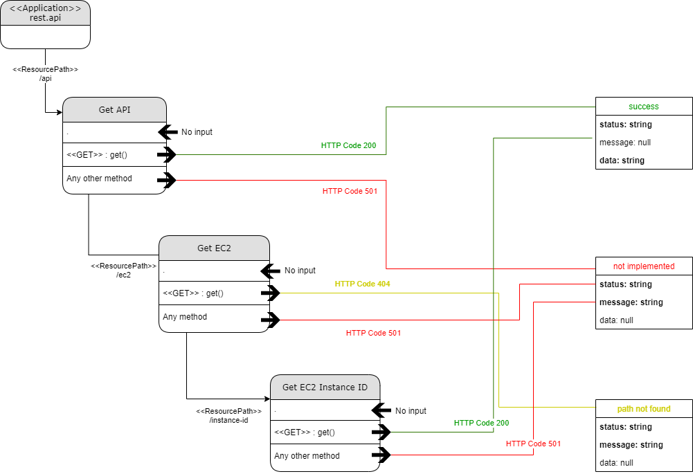

# Project003

## Content

* [Demo description](#demo-description)
* [Repo files overview](#repo-files-overview)
* [Preparing Environment](#preparing-environment)
  * [Create AWS CodeCommit Repositories](#create-aws-codecommit-repositories)
  * [Create AWS CloudFormation stack](#create-aws-cloudformation-stack)
  * [Manually deploy frontend app](#manually-deploy-frontend-app)
  * [Open webclient page](#open-webclient-page)
* [How to use](#how-to-use)
* [Next steps](#next-steps)

## Demo description

An AWS CloudFormation stack configuration deploys a VPC infrastructure supporting EC2 public and private servers hosting, respectively, a webclient (html/php/javascript) and a serverapp (rest c++ api) communicating between each other. Load Balancers are also provided, the frontend balancer accessed by the user via web browser, and the backend one configured to be accessed by the frontend page. Besides infrastructure, the CloudFormation stack also implements an AWS CodePipeline configuration to update both, front and backend apps.

Once private instances need communication to the internet at some point, NAT translation is needed. Two different options for NAT are provided in this demo:
* Stack containing NAT Gateway (yml named "natgateway"), the NAT managed service from AWS
  * AWS resource charged by hour and by traffic, not included in AWS free tier
  * Two resources included; so, costs apply twice!
* Stack containing NAT Instances (yml named "natinstances")
  * A free-of-charge __\*\*\*__ option while inside free tier period in AWS account
  * Not an option for production environments, but perfectly adequate for this demo!

__\*\*\*__ It can be run free of charges inside AWS free tier period, if account creating stack has not yet reached limits of free tier for resources provided by this stack.

```diff
# Reminder: all diagrams included in documentation are Draw.io's editable layered PNGs.
```

## Repo files overview

* Folder webclient:
  * simple webpage intended to provide a "visualization" of AWS infrastructure implemented in this demo. It actually only displays AWS EC2 meta-data from instances hosting the demo (documentation [here](webclient/README.md))
  * <details><summary>see corresponding diagram</summary></details>
* Folder serverapp:
  * simple REST API developed in C++ to return json responses, with focus for this demo on the HTTP GET method for path /ec2/instance-id
  * buildspec.yml
    * YAML file for CodeBuild implemented by CloudFormation files
  * appspec folder and appspec.yml
    * YAML file and scripts for CodeDeploy implemented by CloudFormation files
  * remaining content
    * API source code (documentation [here](serverapp/README.md))
    * <details><summary>see corresponding diagram</summary></details>
* Files cloudformation\*.yml:
  * creates a VPC
    * 4 subnets (2 public, 2 private);
    * 3 route tables (1 for public, 1 for each private subnet);
    * 1 internet gateway (route in public route table);
    * 2 EIPs for NAT ec2 instances;
    * 2 network NACL (1 for public, 1 for private traffic)
      * HTTP/HTTPS/Ephemeral allowed for In/Outbound to CIDR 0.0.0.0/0
	  * SSH/ICMP allowed for In/Outbound to CIDR provided for maintenance
  * creates Security Groups
    * 1 for public instances hosting webclient
      * HTTP/HTTPS allowed for Inbound to CIDR 0.0.0.0/0
	  * SSH/ICMP allowed for Inbound to CIDR provided for maintenance
    * 1 for private instances hosting serverapp
      * Full inside traffic allowed for Inbound to CIDR VPC (x.x.x.x/16)
    * 1 for NAT instances
      * HTTP/HTTPS allowed for Inbound to CIDR of both private Subnets (x.x.x.x/24)
	  * SSH allowed for Inbound to CIDR provided for maintenance
    * 1 for ELB of public instances
      * HTTP 80 allowed for Inbound to CIDR 0.0.0.0/0
    * 1 for ELB of private instances
      * HTTP 8080 allowed for Inbound to CIDR 0.0.0.0/0
  * creates EC2 Instances
    * 4 to host apps (2 for webclient, 2 for serverapp)
      * t2.micro;
      * ubuntu 20.04;
      * Code-Deploy Agent and prereqs of front/back apps installed by cloud init
    * 2 as NAT instances
      * t2.micro;
      * ubuntu 20.04;
      * Configurations to enable IP forwarding and to route packets coming from VPC to outside
  * creates ELBs
    * 1 application ELB, internet-facing, with listener HTTP at port 80 targeting public (webclient) instances
    * 1 application ELB, internal, with listener HTTP at port 8080 targeting private (serverapp) instances
  * creates a pipeline to build and deploy serverapp into private instances
    * 1 S3 Bucket for artifacts
    * 1 CodePipeline (steps: source from CodeCommit, build and deploy) and respective role
    * 1 CodeBuild and respective role
    * 1 CodeDeploy and respective roles (CodeDeploy role and EC2 role for private instances)
<!--* <details><summary>see corresponding diagram</summary></details> -->

## Preparing environment

### Create AWS CodeCommit Repositories

CodePipeline does not support git sparse checkout. For that, CodeCommit shall be used to provide app source codes for CI/CD pipeline:
1. Create CodeCommit repository and upload files from folder webclient;
1. Create CodeCommit repository and upload files from folder serverapp;

### Create AWS CloudFormation stack

Create stack using one of cloudformation\*.yml files. Parameters:
* General Configuration
  * Environment Name: the name to be used for tagging resources created by stack
  * Environment Type: used to define a conditional when creating ports of NetworkACL and Security Groups
    * MAINTENANCE opens ports such as SSH and Ephemeral (for connections to the hosts and execution of APT, for example)
    * PROD disables these same ports
    * The idea is to always run the creation of the stack using MAINTENANCE, updating after to PROD (and alternate between both as necessary)
    * For this demo, keep it as MAINTENANCE
* Network Configuration
  * VPC IP range: CIDR block for VPC created by stack (cannot be already in use)
  * Public/Private SubnetX VPC IP range: CIDR block for public subnet; must be in accordance to VPC's CIDR block; they cannot conflict with CIDR block from each other
* EC2 Configuration
  * KeyPair for EC2 instances: select an already existent key-pair
  * Ip4ServerConnection: IP or CIDR block from machines that can SSH EC2 public\* instances
* Repository configuration
  * CodeCommit repository for frontend code: input the name of CodeCommit created for webclient in previous section
  * CodeCommit repository for backend code: input the name of CodeCommit created for serverapp in previous section
  
\* To SSH private instances, it is necessary to jump-host them:
* Enable SSH Agent Forwarding in SSH client in use
* Connect one of public instances using SSH and from inside it, to SSH private instance

### Manually deploy frontend app

Using SSH, connect to each public EC2 instance (the ones not configured for NAT):
* Copy webclient folder content to /var/www/html
* Edit /var/www/html/config/aws-backend-url replacing
  * \<IP-or-DNS-serverapp\> by DNS from Backend ELB, found in CloudFormation's output as "DNS of ELB Backend"
  * \<port\> by 80

### Open webclient page

Open page using DNS address of Frontend Load Balancer:
   * DNS found in CloudFormation's output as "DNS of ELB Frontend"

## How to use

To refresh the page in the browser triggers the Frontend Load Balancer, alternating the instance-id provided by the targeted instance hosting webclient.

To refresh the page in the browser or to click the button in the page triggers the Backend Load Balancer, alternating the instance-id provided by the targeted instance hosting serverapp.

IMPORTANT: It takes a few minutes until stack creates all the resources, as well for CI/CD pipelines to finish their jobs. Before to run the demo, follow up in AWS consoles the progress of the tasks (specially for CodePipeline).

## Next steps

* Implement AWS CodePipeline stack for frontend app (for that, instructions to manually deploy webclient were provided)
* Document serverapp (c++ api rest) with Swagger
* Document CloudFormation stack (diagram still missing)
