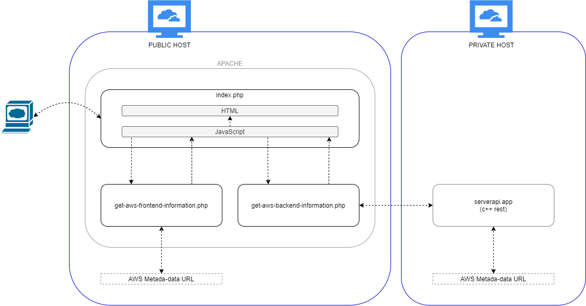

# Project003

## Demo description

A CloudFormation configuration deploys a minor VPC infrastructure supporting EC2 public and private servers hosting, respectively, a webclient (html/php/javascript) and a serverapp (c++) communicating between each other.

The CloudFormation configuration also implements a CodeDeploy configuration to update both, front and backend apps.

All diagrams included in documentation are Draw.io's editable PNGs.

## Repo files overview

* Folder webclient:
  * simple webpage intended to provide a "visualization" of AWS infrastructure implemented in this demo. It actually only displays AWS EC2 meta-data from instances hosting the demo (documentation [here](webclient/README.md))
  * 

corresponding diagram

* Folder serverapp:
  * simple REST API developed in C++ to return json responses, with focus for this demo on the HTTP GET method for path /ec2/instance-id (documentation [here](serverapp/README.md))
  * 

corresponding diagram

* TODO TODO File [cloudformation.yml](cloudformation.yml):
  * creates very (very!) simple VPC
    * 1 subnet (public);
    * 1 route table (for public subnet);
    * 1 internet gateway (route in public route table);
    * 1 network NACL (for public traffic) 
      * HTTP/HTTPS/SSH/Ephemeral for In/Outbound
      * SMTP for Outbound
      * \*\*\* If not using AWS stack for demo, remember to apply the above firewall rules
  * creates security group for instance
    * HTTP/HTTPS/SSH/8080 for Inbound (8080 = Jenkins)
    * SSH for Inbound (if necessary)
  * creates an EC2 instance
    * t2.micro;
    * ubuntu 20.04;
    * Jenkins and Docker installed by cloud init
   

corresponding diagram

* File [appspec.yml](appspec.yml) and appspec_scripts folder:
  * TODO

## Preparing environment

### Create AWS CloudFormation stack

1. Create stack using cloudformation.yml\*
   * EC2 instance will already have Docker and Jenkins installed
1. Open jenkins (http:\\SERVER_IP:8080)
   * SERVER_IP is outupt by cloudformation under "public ip for ec2"
   * Jenkins URL is also output by cloudformation

\* If not using AWS stack for demo, do not forget firewall rules as described in [CloudFormation description](#firewallrules)

### ANY OTHER STPES? TO DO!

1. TO DO

## How to use

1. TO DO
