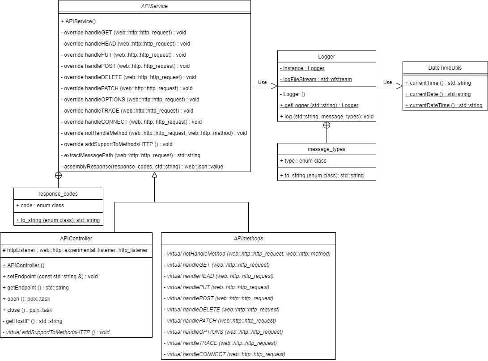
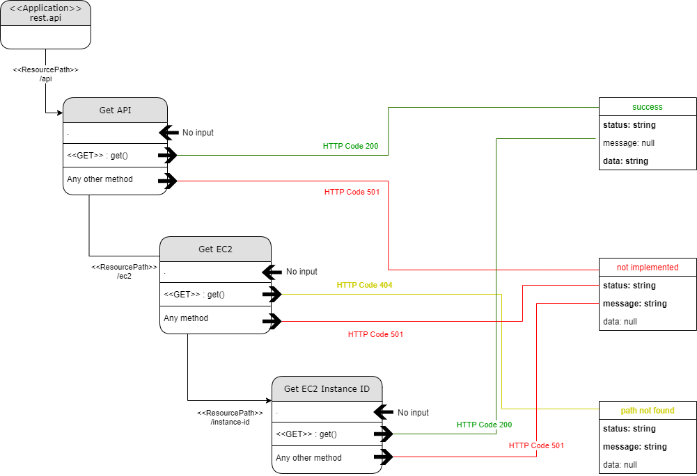

# API REST C++

Documentation in progress...!
<br><br>

For now, check the diagrams:

<details><summary>UML class diagram</summary></details>
<details><summary>REST logic diagram</summary></details>

<br><br>
To run it in default port 8080:

```
./bin/rest.api
```

To run it in other port:

```
./bin/rest.api <port>
```

To use it:

```
curl http://<IP-or-DNS-of-host>:<port>
```

To see its logs, check out folder /log under the same folder where binary is located (by default, inside a /bin folder create during make).
