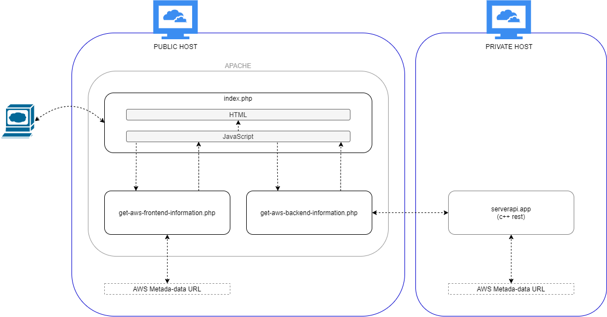
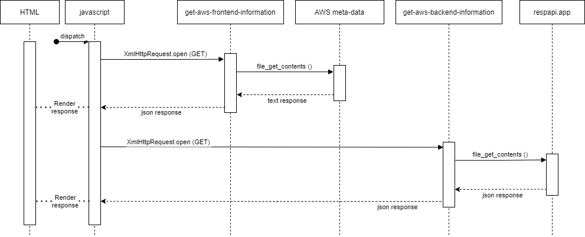

# Web client page

## Description

Simple webpage intended to provide a "visualization" of AWS infrastructure implemented in this demo. It actually only displays AWS EC2 meta-data from instances hosting the demo.
The CloudFormation file for Project003 will provision 2 EC2 public instances (the ones hosting this webclient), and 2 EC2 private instances (the ones hosting the serverapp), with Load Balancers for public and private instances attached. Refreshing this webpage, will then:
* trigger Frontend Load Balancer coordinating all public instances, displaying the instance-id of the host designated by the FLB; and
* trigger Backend Load Balancer coordinating all private instances, displaying the instance-id of the host designated by the BLB.

While webclient instance-id is updated on webpage's refresh, the serverapp instance-id is updated not only at webpages' refresh but also on the click of the available button inside webpage.

## Repo files overview

* File [/config/aws-backend-url](config/aws-backend-url]):
  * Contains the URL to access REST API provided by serverapp
  * Considering that this demo only request instance-id from backend servers, the URL here stored already contains the path included (/api/ec2/instance-id)
* Folder /documents:
  * UML and other diagrams documenting the development
    <details><summary>Modules organization diagram</summary></details>
	<details><summary>UML sequence diagram</summary></details>
* Folder /resources:
  * Folder /css:
    * CSS style files applied to HTML of index.php
  * Folder /images:
    * Images referenced by HTML of index.php
* File [get-aws-backend-information.php](get-aws-backend-information.php):
  * Script to send GET request to API REST provided by serverapp, using URL stored in config file (which already contains request path included)
* File [get-aws-frontend-information.php](get-aws-frontend-information.php):
  * Script to send GET request to AWS meta-data instance-id, using URL hardcoded inside script (AWS metadata URL is constant regardless instance requesting information from it)
* File [index.php](index.php):
  * Main webclient page (HTML and JavaScript code)

## How to deploy

### Install Apache and PHP

This webclient only works at AWS EC2 instances, provided the use of instance-id as center of this demo. For that, while following commands (considering debian-based distros) can be used to manually install Apache and PHP, this task will be actually performed by CloudInit of EC2 instances inside CloudFormation. For reference:

```
$ sudo apt install php -y
```
```
$ #Apache...
$ sudo apt install apache2 -y
$ #... adding user 'ubuntu' to apache group
$ sudo usermod -a -G apache ubuntu
$ #... ownership and permissions
$ sudo chown -R ubuntu:apache /var/www
$ sudo chmod 2775 /var/www
$ #... Apache on boot
$ sudo systemctl enable apache2
$ #... starting
$ sudo systemctl start apache2
```

### Copy application to Apache's www folder

Simply copying (or cloning) webclient folder content to Apache's /var/www/html folder.

## How to open

Open webpage http://\<DNS-front-load-balancer\>/index.html:
* Refresh page to exercise Frontend Load Balancer (each time load is targeted in a different public EC2 host, the corresponding EC2 instance-id is displayed);
* Refresh the page or click button to to exercise Backend Load Balancer (each time load is targeted in a different private EC2 host, the corresponding EC2 instance-id is displayed).
