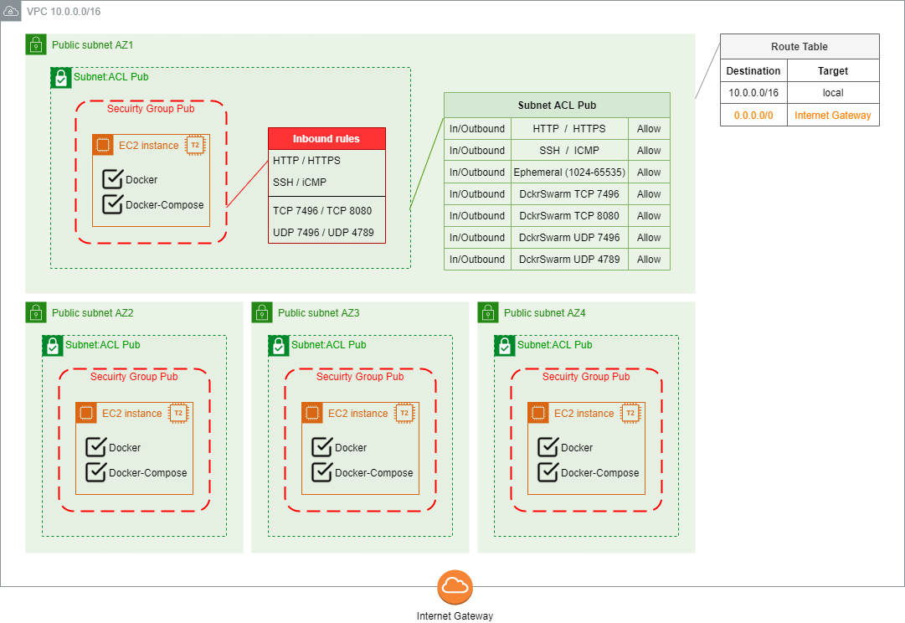

# Project004

## Content

* [Demo description](#demo-description)
* [Repo files overview](#repo-files-overview)
* [Preparing Environment](#preparing-environment)
  * [Create AWS CloudFormation stack](#create-aws-cloudformation-stack)
  * [Configuring Docker Swarm](#configuring-docker-swarm)

## Demo description

A CloudFormation stack configuration to work with Docker Swarm.

```diff # Reminder: all diagrams included in documentation are Draw.io's editable layered PNGs.```

## Repo files overview

* File [cloudformation.yml](cloudformation.yml):
  * creates a VPC
    * 4 subnets (all public, one in each AZ);
    * 1 route table (for public subnets);
    * 1 internet gateway (route in public route table);
    * 1 network NACL (for public traffic, swarm port configured)
      * HTTP/HTTPS/SSH/ICMP/Ephemeral allowed for In/Outbound to CIDR 0.0.0.0/0
      * Docker Swarm Management (TCP 2377) allowed for In/Outbound to CIDR VPC (x.x.x.x/16)
	  * Docker Swarm Nodes (TCP 7496) allowed for In/Outbound to CIDR VPC (x.x.x.x/16)
	  * Docker Swarm Nodes (UDP 7496) allowed for In/Outbound to CIDR VPC (x.x.x.x/16)
	  * Docker Swarm Network Overlay (UDP 4789) allowed for In/Outbound to CIDR VPC (x.x.x.x/16)
  * creates security group for ec2 instances
    * HTTP/HTTPS/SSH/ICMP for Inbound to CIDR 0.0.0.0/0
	* Full "inside group" TCP (0-65535) allowed for Inbound, Docker Swarm Nodes (TCP 7496) included
	* Full "inside group" Docker Swarm Nodes (UDP 7496) allowed for Inbound
	* Full "inside group" Docker Swarm Network Overlay (UDP 4789) allowed for Inbound
	* Docker Swarm Visualizer (TCP 8080) allowed for Inbound to CIDR 0.0.0.0/0
  * creates 4 EC2 instances (one in each subnet)
    * t2.micro;
    * ubuntu 20.04;
    * Docker and Docker-Compose installed by cloud init
  * <details><summary>see corresponding diagram</summary></details>

## Preparing environment

### Create AWS CloudFormation stack

* General Configuration
  * Environment Name: the name to be used for tagging resources created by stack
  * Environment Type: used to define a conditional when creating ports of NetworkACL and Security Groups
    * MAINTENANCE opens ports such as SSH and Ephemeral (for connections to the hosts and execution of APT, for example)
    * PROD disables these same ports
    * The idea is to always run the creation of the stack using MAINTENANCE, updating after to PROD (and alternate between both as necessary)
    * For this demo, keep it as MAINTENANCE
* Network Configuration
  * VPC IP range: CIDR block for VPC created by stack (cannot be already in use)
  * Public SubnetX VPC IP range: CIDR block for public subnet; must be in accordance to VPC's CIDR block; they cannot conflict with CIDR block from each other
* EC2 Configuration
  * KeyPair for EC2 instances: select an already existent key-pair
  * Ip4ServerConnection: IP or CIDR block from machines that can SSH EC2 public instances

### Configuring Docker Swarm

1. At manager host (choose one of EC2 instances), initialize swarm cluster with command:
```
$ docker swarm init
```

2. In each worker node (remaining EC2 instances), execute the command to ingress into the manager cluster. The command is displayed as result of the previous step, but it can be retrieves running:
```
$ docker swarm join-token manager
```

3. Deploy whichever desired example of containerized stack (recommended: https://github.com/dockersamples/example-voting-app):
```
$ git clone URL
$ cd <git-cloned-folder>
$ docker stack deploy -c docker-compose.yml app
```
