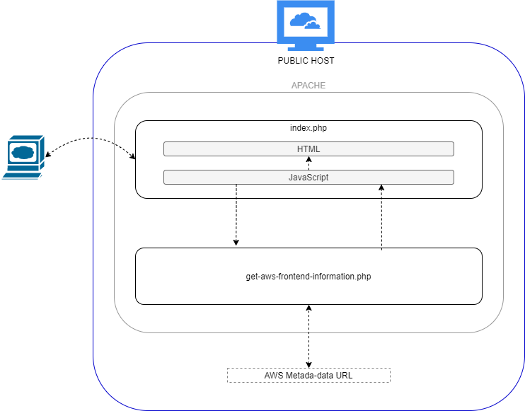
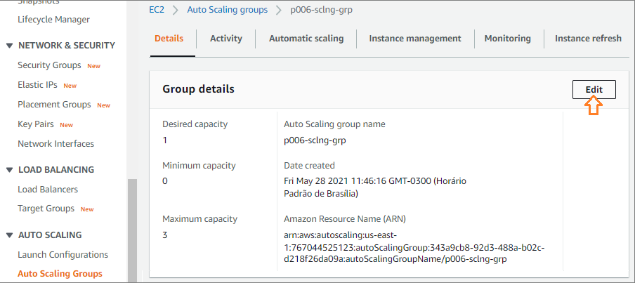

# Project006

## Content

* [Demo description](#demo-description)
* [Repo files overview](#repo-files-overview)
* [Preparing Environment](#preparing-environment)
  * [Creating AWS CloudFormation stack](#creating-aws-cloudformation-stack)
  * [Opening site](#opening-site)
* [How to use](#how-to-use)
  * [Understanding instance availability time](#understanding-instance-availability-time)
    * [ELB deregistering time](#elb-deregistering-time)
    * [Final testing times](#final-testing-times)
  * [Updating Auto Scaling Desired Capacity configuration](#updating-auto-scaling-desired-capacity-configuration)
  * [Checking Auto Scaling configuration taking effect](#checking-auto-scaling-configuration-taking-effect)
* [Next steps](#next-steps)

## Demo description

Demonstrate Ansible's playbook deploying a web page on AWS Cloud with Auto Scaling and Elastic Load Balancer.

The CloudFormation deploys a stack containing an EC2 Template for Auto Scaling, that is associated to an ELB. During EC2 instances provisioning by Auto Scaling, the Systems Manager's State Manager is used to run a command using:
* the document 'AWS-ApplyAnsiblePlaybooks', in template named "cloudformation-ssdocamazon.yml"; or
* the document created by stack, with similar function, in template named "cloudformation-ssmdoccustom.yml".
The ELB takes part with Health Checks for EC2, controlling traffic and registering/deregistering instances according to Auto Scaling actions.

The ELB's DNS address can be opened to check web page's deployment, displaying IDs of healthy instances provisioned by Auto Scaling.

```diff
# Reminder: all diagrams included in documentation are Draw.io's editable layered PNGs.
```

## Repo files overview

* Folder **website**:
  * simple webpage intended to provide a "visualization" of AWS infrastructure implemented in this demo. It actually only displays AWS EC2 meta-data from instances hosting the demo (documentation [here](website/README.md))
  * <details><summary>see website modules diagram</summary></details>
* Files **cloudformation/*.yml**:
  * creates a VPC
    * 1 subnet (public);
    * 1 route table (for public subnet);
    * 1 internet gateway (route in public route table);
    * 1 network NACL (for public traffic)
      * HTTP/HTTPS/Ephemeral allowed for In/Outbound to CIDR 0.0.0.0/0
      * SSH allowed for In/Outbound to CIDR provided for maintenance
  * creates a security group for instances
    * HTTP/HTTPS allowed for Inbound to CIDR 0.0.0.0/0
    * SSH allowed for Inbound to CIDR provided for maintenance
  * creates security groups
    * 1 for EC2 public instances
      * HTTP/HTTPS allowed for Inbound to CIDR 0.0.0.0/0
      * SSH allowed for Inbound to CIDR provided for maintenance
    * 1 for ELB of public instances
      * HTTP 80 allowed for Inbound to CIDR 0.0.0.0/0
  * creates a IAM role and a Instance Profile for EC2 instances
    * allowing SSM to manage instances
    * allowing Auto Scaling Lifecycle Hook completion
  * creates an EC2 template to launch instances
    * t2.micro;
    * ubuntu 20.04;
    * CLI installed by cloud init
  * creates an application ELB, internet-facing, with listener HTTP at port 80 targeting public instances
  * creates an Auto Scaling group, using EC2 template to launch instances into ELB
  * creates an Systems Manager's State Manager Association
    * using the document 'AWS-ApplyAnsiblePlaybooks', owned by Amazon, in template named "-ssmdocamazon.yml";
    * using the document '<environmentname>-ssmdoc-ansible', created by template itself, in template named "-ssmdoccustom.yml";
  * <details><summary>see CloudFormation diagram</summary></details>
* File **[playbook.yml](playbook.yml)**:
  * Playbook to install Apache and PHP, and to sparse checkout and deploy website folder
    * 2 plays, tasks including 'apt', 'service', 'file, 'linefile', 'shell' and 'copy';
  * NOTE: take care with names of plays and tasks; to run a playbook within AWS Systems Manager documents, they cannot contain some chars that Ansible usually allows, such as \(\) or \-

## Preparing environment

### Creating AWS CloudFormation stack

In AWSCloudFormation console, create stack using cloudformation.yml file. Parameters:
* General Configuration
  * Environment Name: the name to be used for tagging resources created by stack
  * ExtendedLogOption: choose 'true' to have SSM State Manager full command output to S3, or 'false' to keep the standard output truncated at 2500 chars in console only
* Network Configuration
  * VPC IP range: CIDR block for VPC created by stack (cannot be already in use)
  * Public SubnetX VPC IP range: CIDR block for public subnet 1 and 2; they must be in accordance to VPC's CIDR block; they cannot conflict with CIDR block from each other
* EC2 Configuration
  * KeyPair for EC2 instances: select an already existent key-pair
  * Ip4ServerConnection: IP or CIDR block from machines that can SSH EC2 public instances

### Opening site

Open the DNS address provided by CloudFormation to ELB:
   * DNS found in CloudFormation's output as "DNS of Elastic Load Balancer"

It shall display message "503 Service Temporarily Unavailable" until everything is in place (AutoScaling and ELB health checks, plus State Manager execution). Next section explains total amount of time expected for the first instance to get fully running and how to test the addition/removal of new instances using Auto Scaling.

## How to use

### Understanding instance availability time

Next sections assume previous (basic) knowledge of AWS Auto Scaling and AWS Elastic Load Balancer, elucidating only aspects that directly impacts availability times for instances provisioned by Auto Scaling.

#### Auto Scaling Lifecycle Hook

Lifecycle hooks are an Auto Scaling capability that allows Auto Scaling Group to be aware of EC2 instances lifecycle, providing a "pause" in EC2 instance state transitions. If it is a launch hook, it keeps instance in 'pending' state; if it is a termination hook, it keeps instance in 'terminating' state. In both cases, custom actions can be performed until the "pause" ends either by the timeout configured for the hook, or by receiving a "complete-lifecycle-action" signal. If the signal received is CONTINUE, it indicates that the instance can transition to the next lifecycle states ('running' for launch hooks, 'terminated' for termination ones). If the signal is ABANDON, instances being launched are terminated, while instances terminating abort any other following action and terminate indeed. The lifecycle hooks timed out assume the default result indicated in hook's configuration.

The lifecycle hook "pause" is established configuring the 'Heartbeat Timeout'. In case of launch hooks, it shall be sufficient to cover the start and UserData execution of an EC2 instance, plus any other action to run before the "complete-action" signal. This demo implements a launch hook for Auto Scaling Group (CloudFormation's resource EC2AutoScalingGroup) with Heartbeat Timeout of 420 seconds:

```yaml
EC2AutoScalingGroup:
  (...)
  LifecycleHookSpecificationList:
    HeartbeatTimeout: 420 #enough for: EC2 to start and run UserData + State Manager to execute AWS-ApplyAnsiblePlaybooks (installation/playbook)
```

The timeout configured, established after some measuring, covers the start and UserData execution of EC2, and the execution of State Manager association running the AWS-ApplyAnsiblePlaybooks document. The association happens as soon as the instances join Systems Manager's fleet, and is responsible for raising the "complete-lifecycle-action", signaled inside last task of playbook.yml, after the deploy of web site in Apache's www folder.

#### Auto Scaling and ELB health checks TO-DO

Auto Scaling uses by default its own health checks
```yaml
ELoadBalancerTargetGroup:
  HealthCheckIntervalSeconds: 5 #seconds between health checks
  HealthCheckTimeoutSeconds: 4 #amount of seconds during which no response means a failed check (must be < HealthCheckIntervalSeconds)
  UnhealthyThresholdCount: 2 #number of consecutive checks failing before a healthy target becomes unhealthy
  HealthyThresholdCount: 2 #number of consecutive checks succeeding before an unhealthy target becomes healthy

ENTAO,

EC2AutoScalingGroup:
  HealthCheckType: ELB #besides AutoScaling default EC2 status checks, it also considers ELB health checks (unhealthy when at least one fails)
  HealthCheckGracePeriod: 0 #how long before to start using ELB's health checks (it starts counting after LifecycleHook completion or timeout)
	  
EC2AutoScalingGroup.HealthCheckGracePeriod: 0 #shall cover the expected startup time for your application, from when an instance comes into service to when it can receive traffic (ELB health checks). If you add a lifecycle hook, the grace period does not start until the lifecycle hook actions are completed and the instance enters the InService state.
```

#### ELB deregistering time TO-DO

The ELB provides configuration for instances' time deregistration. Also named draining time, it avoid breaking open connections while taking an instance out of service. It usually consider an amount of time sufficient to not abort running operations in the instances, but for this demo, considering that the web page does nothing but to show EC2 metadata (no connections created), the draining time was configured as 30 seconds only:

```yaml
ELoadBalancerTargetGroup:
  TargetGroupAttributes:
    - Key: deregistration_delay.timeout_seconds #amount of time (seconds) to wait before changing the state of a deregistering to unused
      Value: 30
```

#### Final testing times

For each instance scaled-up in Auto Scaling (through increase of Desired Capacity):
* if something goes wrong during instance launch, UserData execution, or playbook execution by State Manager, it will take 'HeartbeatTimeout' (i.e, 420) seconds for the lifecycle hook to timeout, aborting launch once it is configured to assume ABANDON result for timeouts;
* if everything runs fine, is expected the instance to be receiving traffic when:
  * the playbook raises the "complete-lifecycle-action" (about 360 seconds after the launch of instance); and
  * ELB's health checks perform 'HealthyThresholdCount' checks with success, during 'HealthCheckIntervalSeconds' each one (i.e., 2\*8, 16 seconds);
* summing up, it takes ~380 seconds for registering instances start to appear in refreshes of web site deployed (slight variations may apply).

Instances scaled-down (decreasing Desired Capacity) will be deregistered much faster from ELB, given the small draining time 'deregistration_delay.timeout_seconds' configured (30 seconds).

### Updating Auto Scaling Desired Capacity configuration

1. Open EC2 console, navigate menu 'Auto Scaling' and click Auto Scaling Group created by stack (if using CloudFormation default parameters, it shall be named 'p006-sclng-grp');
1. Under menu 'Details', click Edit button in 'Group Details:
<p align="center"></p>
1. Input desired capacity to provision or delete instances:
   * Stack is provided with defaults 0, 1 and 3 for Minimum, Desired and Maximum capacities, respectively;
   * All capacities can be updated; desired capacity is the one that actually defines the number of instances running;
1. Click Update button.

### Checking Auto Scaling configuration taking effect

1. When the update of Auto Scaling configuration is confirmed, it will start to register/deregister instances according new desired capacity, taking approximately the time [previously explained](#autoscaling-and-elb-health-checks-explained) for the new instance(s) to engage or leave Load Balancer;
1. Refresh web page a few times: when instances finish registering, their IDs shall eventually appear in the page; when they deregister, they stop appearing.
<p align="center"></p>

## Next steps

* Add missing "cloudformation-ssmdoccustom.yaml"
* Add missing documentation

