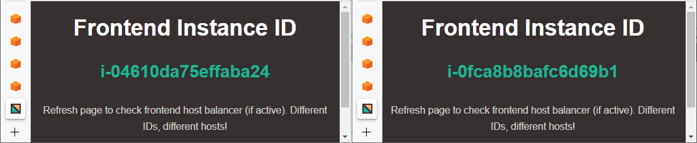

# Project006

## Content

* [Demo description](#demo-description)
* [Repo files overview](#repo-files-overview)
* [Preparing Environment](#preparing-environment)
  * [Creating AWS CloudFormation stack](#creating-aws-cloudformation-stack)
  * [Confirming SNS subscription](#confirming-sns-subscription)
  * [Opening site](#opening-site)
* [How to use](#how-to-use)
  * [Understanding instance availability time](#understanding-instance-availability-time)
    * [Auto Scaling Lifecycle Hook](#auto-scaling-lifecycle-hook)
    * [Auto Scaling using ELB health checks](#auto-scaling-using-elb-health-checks)
    * [ELB deregistering time](#elb-deregistering-time)
    * [Consideration about testing times](#consideration-about-testing-times)
  * [Updating Auto Scaling Desired Capacity configuration](#updating-auto-scaling-desired-capacity-configuration)
  * [Checking Auto Scaling configuration taking effect](#checking-auto-scaling-configuration-taking-effect)
* [Next steps](#next-steps)

## Demo description

Demonstrate Ansible's playbook deploying a web page on AWS Cloud with Auto Scaling and Elastic Load Balancer.

The CloudFormation deploys a stack containing an EC2 Template for Auto Scaling, that is associated to an ELB. During EC2 instances provisioning by Auto Scaling, the Systems Manager's State Manager is used to run a command using:
* the document 'AWS-ApplyAnsiblePlaybooks', in template named "cloudformation-ssdocamazon.yml"; or
* the document created by stack, with similar function, in template named "cloudformation-ssmdoccustom.yml".
The ELB takes part with Health Checks for EC2, controlling traffic and registering/deregistering instances according to Auto Scaling actions.

The ELB's DNS address can be opened to check web page's deployment, displaying IDs of healthy instances provisioned by Auto Scaling.

```diff
# Reminder: all diagrams included in documentation are Draw.io's editable layered PNGs.
```

## Repo files overview

* Folder **website**:
  * simple webpage intended to provide a "visualization" of AWS infrastructure implemented in this demo. It actually only displays AWS EC2 meta-data from instances hosting the demo (documentation [here](website/README.md))
  * <details><summary>see website modules diagram</summary></details>
* Files **cloudformation/*.yml**:
  * creates a VPC
    * 1 subnet (public);
    * 1 route table (for public subnet);
    * 1 internet gateway (route in public route table);
    * 1 network NACL (for public traffic)
      * HTTP/HTTPS/Ephemeral allowed for In/Outbound to CIDR 0.0.0.0/0
      * SSH allowed for In/Outbound to CIDR provided for maintenance
  * creates a security group for instances
    * HTTP/HTTPS allowed for Inbound to CIDR 0.0.0.0/0
    * SSH allowed for Inbound to CIDR provided for maintenance
  * creates security groups
    * 1 for EC2 public instances
      * HTTP/HTTPS allowed for Inbound to CIDR 0.0.0.0/0
      * SSH allowed for Inbound to CIDR provided for maintenance
    * 1 for ELB of public instances
      * HTTP 80 allowed for Inbound to CIDR 0.0.0.0/0
  * creates a IAM role and a Instance Profile for EC2 instances
    * allowing SSM to manage instances
    * allowing Auto Scaling Lifecycle Hook completion
  * creates an EC2 template to launch instances
    * t2.micro;
    * ubuntu 20.04;
    * CLI installed by cloud init
  * creates an application ELB, internet-facing, with listener HTTP at port 80 targeting public instances
  * creates an Auto Scaling group, using EC2 template to launch instances into ELB
  * creates an Systems Manager's State Manager Association
    * using the document 'AWS-ApplyAnsiblePlaybooks', owned by Amazon, in template named "-ssmdocamazon.yml";
    * using the document '<environmentname>-ssmdoc-ansible', created by template itself, in template named "-ssmdoccustom.yml";
  * creates an S3 bucket for Systems Manager's State Manager extended log (optional)
  * <details><summary>see CloudFormation diagram</summary></details>
* File **[playbook.yml](playbook.yml)**:
  * Playbook to install Apache and PHP, and to sparse checkout and deploy website folder
    * 2 plays, tasks including 'apt', 'service', 'file, 'linefile', 'shell' and 'copy';
  * NOTE: take care with names of plays and tasks; to run a playbook within AWS Systems Manager documents, they cannot contain some chars that Ansible usually allows, such as \(\) or \-

## Preparing environment

### Creating AWS CloudFormation stack

In AWSCloudFormation console, create stack using cloudformation.yml file. Parameters:
* General Configuration
  * Environment Name: the name to be used for tagging resources created by stack
  * Log Option for State Manager execution: choose 'true' to have SSM State Manager full command output to S3, or 'false' to keep the standard output truncated at 2500 chars in console only
* Network Configuration
  * VPC IP range: CIDR block for VPC created by stack (cannot be already in use)
  * 1st/2nd Public Subnet VPC IP range: CIDR block for public subnets 1 and 2; they must be in accordance to VPC's CIDR block; they cannot conflict with CIDR block from each other
* EC2 Configuration
  * KeyPair for EC2 instances: select an already existent key-pair
  * Ip4ServerConnection: IP or CIDR block from machines that can SSH EC2 public instances
* Notifications
  * Notification option: choose 'true' to enable SNS emails over Auto Scaling actions, or 'false' to disable email notifications
  * Email to receive notifications: the email to receive SNS notifications

### Confirming SNS subscription

With notifications enabled, the provided email will receive a message named "AWS Notification - Subscription Confirmation" during stack creation. In order to receive the Auto Scaling notifications, it is necessary to click the link "Confirm subscription" inside it. The message "Subscription confirmed! You have successfully subscribed" is then displayed.

### Opening site

Open the DNS address provided by CloudFormation to ELB:
   * DNS found in CloudFormation's output as "DNS of Elastic Load Balancer"

It shall display message "503 Service Temporarily Unavailable" until everything is in place (AutoScaling and ELB health checks, plus State Manager execution). Next section explains total amount of time expected for the first instance to get fully running and how to test the addition/removal of new instances using Auto Scaling.

## How to use

### Understanding instance availability time

Next sections assume previous (basic) knowledge of AWS Auto Scaling and AWS Elastic Load Balancer, elucidating only aspects that directly impacts availability times for instances provisioned by Auto Scaling and that can be directly controlled by stack configuration.

#### Auto Scaling Lifecycle Hook

Lifecycle hooks are an Auto Scaling capability that allows Auto Scaling Group to be aware of EC2 instances lifecycle, providing a "pause" in EC2 instance state transitions. If it is a launch hook, it keeps instance in 'pending:wait' state; if it is a termination hook, it keeps instance in 'terminating:wait' state. In both cases, custom actions can be performed until the "pause" ends either by the timeout configured for the hook, or by receiving a "complete-lifecycle-action" signal. If the signal received is CONTINUE, it indicates that the instance can transition to the next lifecycle states ('pending:proceed' for launch hooks, 'terminating:proceed' for termination ones). If the signal is ABANDON, instances being launched are terminated, while instances terminating abort any other following action and terminate indeed. The lifecycle hooks timed out assume the default result indicated in hook's configuration.

The lifecycle hook "pause" is established configuring the 'Heartbeat Timeout'. In case of launch hooks, it shall be sufficient to cover the UserData execution of an EC2 instance, plus any other action to run before the "complete-action" signal. The best way to determine it by measuring executions and checking parallelism of tasks, considering that some tasks may start while UserData is still running.

This demo implements a launch hook for Auto Scaling Group (CloudFormation's resource EC2AutoScalingGroup) with Heartbeat Timeout of:

* 420 seconds for "cloudformation-ssdocamazon":
```yaml
EC2AutoScalingGroup:
  LifecycleHookSpecificationList:
    HeartbeatTimeout: 420 #enough for EC2 to start and run UserData + State Manager to execute AWS-ApplyAnsiblePlaybooks (measured ~360 s)
```
* 200 seconds for "cloudformation-ssdoccustom":
```yaml
EC2AutoScalingGroup:
  LifecycleHookSpecificationList:
    HeartbeatTimeout: 200 #enough for EC2 to start and run UserData + State Manager to execute SSMDocumentCustomAnsible (measured ~130 s)
```

The timeouts configured cover the execution of UserData and of State Manager association running the AWS-ApplyAnsiblePlaybooks for "cloudformation-ssdocamazon", and a provided custom document for "cloudformation-ssdocamazon". The association happens as soon as the instances join Systems Manager's fleet, and is responsible for raising the "complete-lifecycle-action", signaled inside last task of playbook.yml, after the deploy of web site in Apache's www folder.

#### Auto Scaling using ELB health checks

The ELB's health check configuration is defined as follows:
```yaml
ELoadBalancerTargetGroup:
  HealthCheckIntervalSeconds: 5 #seconds between health checks
  HealthCheckTimeoutSeconds: 4 #amount of seconds during which no response means a failed check (must be < HealthCheckIntervalSeconds)
  UnhealthyThresholdCount: 2 #number of consecutive checks failing before a healthy target becomes unhealthy
  HealthyThresholdCount: 2 #number of consecutive checks succeeding before an unhealthy target becomes healthy
```

When Auto Scaling is configured to use ELB's health checks, it starts to actually use them 'HealthCheckGracePeriod' seconds after Lifecycle Hook completion or timeout. The completion signal is raised inside Ansible's playbook, after the web site is deployed in Apache's www folder. That said, the 'HealthCheckGracePeriod' was configured to zero, once that the health checks in path \'\/\' can be started right away:
```yaml
EC2AutoScalingGroup:
  HealthCheckType: ELB #besides AutoScaling default EC2 status checks, it also considers ELB health checks (unhealthy when at least one fails)
  HealthCheckGracePeriod: 0 #how long before to start using ELB's health checks (it starts counting after LifecycleHook completion or timeout)
```

So, according to configuration specified, it is expected a healthy instance provisioned by Auto Scaling to start receiving traffic from ELB at ~12 seconds (1st check of 8 seconds + 2nd check as soon as it determines success) after LifecycleHook completion.

#### ELB deregistering time

The ELB provides configuration for instances' time deregistration. Also named draining time, it avoid breaking open connections while taking an instance out of service. It usually consider an amount of time sufficient to not abort running operations in the instances, but for this demo, considering that the web page does nothing but to show EC2 metadata (no connections created), the draining time was configured as 30 seconds only:

```yaml
ELoadBalancerTargetGroup:
  TargetGroupAttributes:
    - Key: deregistration_delay.timeout_seconds #amount of time (seconds) to wait before changing the state of a deregistering to unused
      Value: 30
```

#### Consideration about testing times

Below figures show some measuring of times over important events for both stacks:
<p align="center"></p>
<p align="center"></p>

The images pinpoint some important considerations to take when determining testing times (and even to drive some design decisions):

1. some events cannot be configured and thus have to be considered in average, for example:
   * the time between update of Auto Scaling desired capacity (1) and the actual launch of instance (2), where measures vary from 5 to 25 seconds (average ~15);
   * the time between the starting of instance launch (2) and the creation of lifecycle hook (4), measured ~30 seconds;
   * the time between lifecycle hook launch (4) and State Manager document association (not represented), after which the document is run (6), where measures vary from 30 to 55 seconds (average ~40);
1. some events, besides to have to be considered in average, also happen in parallel to others, requiring even some design decisions to avoid problems. Is the case of the State Manager association that happens when UserData is still running, which means that playbook's task using 'apt' might compete for locks with UserData, installing AWS CLI. This situation defined the necessity of the ansible.builtin.apt configuration for retries inside playbook.

For all the exposed so far, we can consider for each instance scaled-out in Auto Scaling (through increase of Desired Capacity), that:
* the average time between to change auto scaling capacity and the instance to start launching is ~15 seconds;
* the average time between the instance to start launch and lifecycle hook to launch is ~30 seconds;
* if something goes wrong during instance launch, UserData execution, or playbook execution by State Manager, it will take 'HeartbeatTimeout' seconds for the lifecycle hook to timeout, aborting launch once it is configured to assume ABANDON result for timeouts:
  * for "cloudformation-ssdocamazon.yml", this means 420 seconds;
  * for "cloudformation-ssdoccustom.yml", this means 200 seconds;
* if everything runs fine, is expected the instance to be receiving traffic when: (1) the playbook raises the "complete-lifecycle-action"; plus (2) ELB's health checks perform 'HealthyThresholdCount' checks with success, during 'HealthCheckIntervalSeconds' each one. So:
  * for "cloudformation-ssdocamazon.yml", this means completion of lifecycle around 380 seconds after launch of instances, plus 2 checks of 8 seconds each, resulting in ~395 seconds;
  * for "cloudformation-ssdoccustom.yml", this means completion of lifecycle around 150 seconds after launch of instances, plus 2 checks of 8 seconds each, resulting in ~165 seconds;
  
Summing up, it takes ~440 or ~210 seconds, depending of the stack used, for registering instances start to appear in refreshes of web site deployed. Considering that all measures are averages, variations up/down may apply.

Instances scaled-in (decreasing Desired Capacity) will be deregistered much faster from ELB, given the small draining time 'deregistration_delay.timeout_seconds' configured (30 seconds).

### Updating Auto Scaling Desired Capacity configuration

1. Open EC2 console, navigate menu 'Auto Scaling' and click Auto Scaling Group created by stack (if using CloudFormation default parameters, it shall be named 'p006-sclng-grp');
1. Under menu 'Details', click Edit button in 'Group Details:
   <p align="center"></p>
1. Input desired capacity to provision or delete instances:
   * Stack is provided with defaults 0, 1 and 3 for Minimum, Desired and Maximum capacities, respectively;
   * All capacities can be updated; desired capacity is the one that actually defines the number of instances running;
1. Click Update button.

### Checking Auto Scaling configuration taking effect

1. When the update of Auto Scaling configuration is confirmed, it will start to register/deregister instances according new desired capacity, taking approximately the time [previously explained](#autoscaling-and-elb-health-checks-explained) for the new instance(s) to engage or leave Load Balancer;
1. Refresh web page a few times: when instances finish registering, their IDs shall eventually appear in the page; when they deregister, they stop appearing.
<p align="center"></p>

## Next steps

* Add missing cloudformation diagram
* REVIEW DOCUMENT WITH ATTENTION! =D

