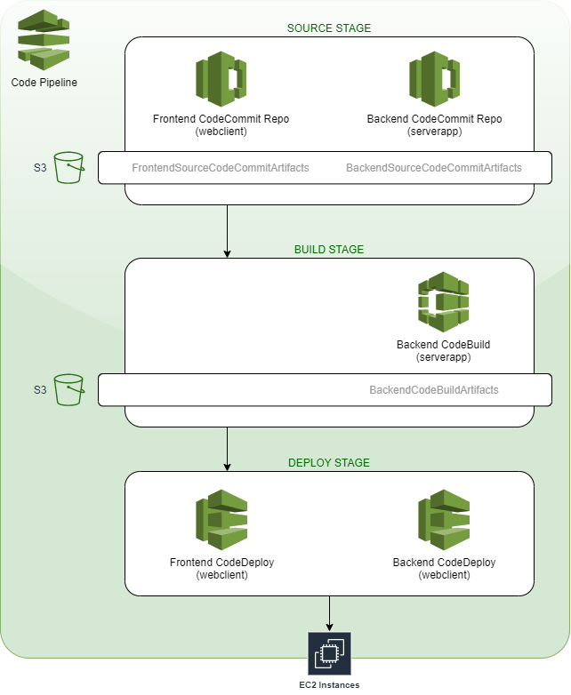

# DevOps Sandbox Projects

Sandbox for demos of tools usually involved in DevOps loop.

---

## Project001

**Purpose:** Demonstrate a Jenkins' pipeline triggered by GitHub's webhook, building a Docker image to host a very simple website (documentation [here](Project001/README.md)).

  

    
Jenkins diagram

    
  

**Tools and technologies:** Jenkins :black_small_square: GitHub :black_small_square: Docker :black_small_square: DockerHub :black_small_square: AWS CloudFormation containing VPC (Subnets, Route Tables, Network ACLs, SecGroups, Internet Gateway) and EC2 (instances) :black_small_square: YAML

---

## Project002

**Purpose:** Demonstrate Ansible's automated configuration over AWS Cloud (documentation [here](Project002/README.md)).

Details

**Tools and technologies:** Ansible :black_small_square: AWS CloudFormation containing VPC (Subnets, Route Tables, Network ACLs, SecGroups, Internet Gateway) and EC2 (instances) :black_small_square: YAML :black_small_square: JSON

---

## Project003

**Purpose:** Demonstrate AWS CloudFormation stack creation including NAT (instances and gateways, two stacks provided), Load Balancers and AWS CodePipeline (CodeCommit + CodeBuild + CodeDeploy). The final result shows a webpage and a rest c++ api deployed in order to exercise balancers from front/backend servers (documentation [here](Project003/README.md)).

CloudFormation diagram (pending)

CodePipeline diagram

Rest C++ API diagram

WebPage diagram

**Tools and technologies:** AWS CloudFormation containing VPC (Subnets, Route Tables, Network ACLs, SecGroups, Internet Gateway, NATGateway/NATinstances, EIP), EC2 (Instances, application ELB), CodePipeline (CodeCommit, CodeBuild, CodeDeploy), IAM (Roles, InstanceProfiles) and Systems Manager (Param Store) :black_small_square: C++ :black_small_square: HTML :black_small_square: PHP :black_small_square: JSON :black_small_square: YAML

---

## Project004

**Purpose:** Demonstrate AWS CloudFormation stack creation to work with Docker Swarm (documentation [here](Project004/README.md)).

CloudFormation diagram

**Tools and technologies:** Docker Swarm :black_small_square: Docker-Compose :black_small_square: AWS CloudFormation containing VPC (Subnets, Route Tables, Network ACLs, SecGroups, Internet Gateway) and EC2 (instances) :black_small_square: YAML

---

## Project005

**Purpose:** Demonstrate Ansible's playbooks into AWS Cloud Services, deploying them using AWS Systems Manager (documentation [here](Project005/README.md)).

Details

**Tools and technologies:** Ansible :black_small_square: AWS CloudFormation containing VPC (Subnets, Route Tables, Network ACLs, SecGroups, Internet Gateway), EC2 (instances) and IAM roles :black_small_square: AWS Systems Manager (Run Command) :black_small_square: YAML
